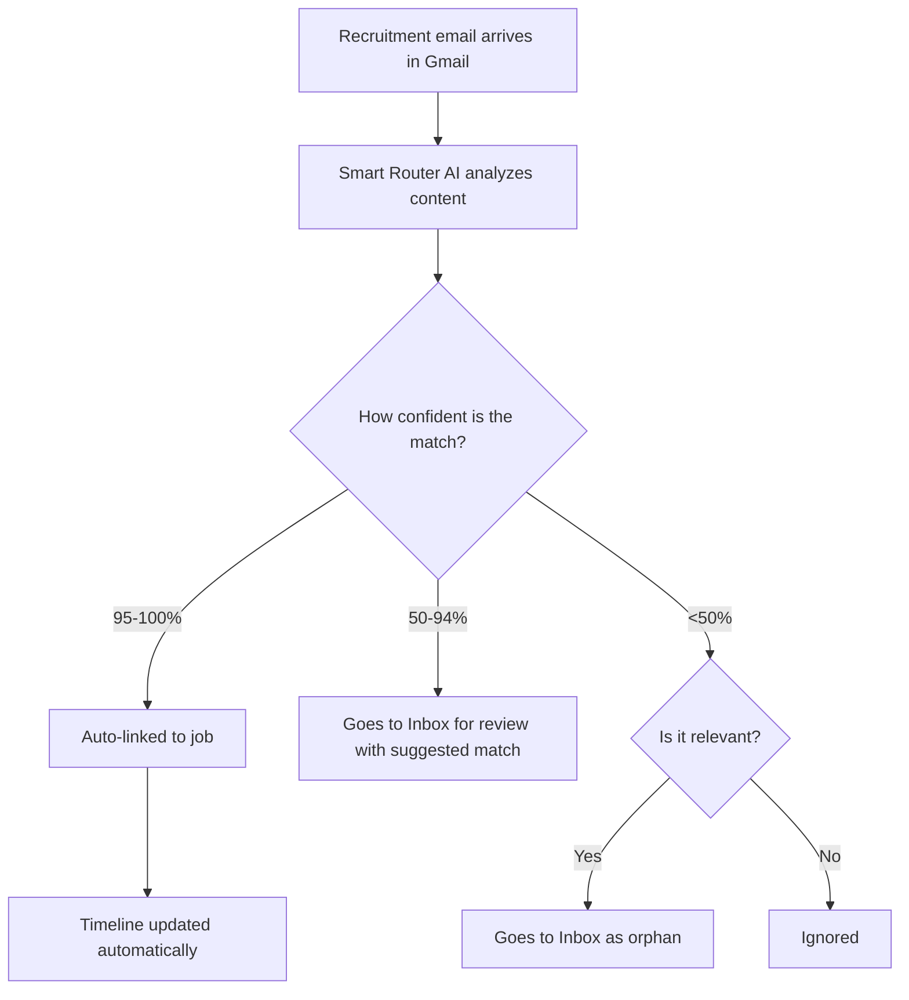

The Tracking Inbox monitors Gmail for job-application responses and updates timelines.


## Overview

1. Scans Gmail for recruitment-related emails
2. Matches emails to tracked jobs using AI
3. Updates timeline/state when confidence is high
4. Queues uncertain matches for manual review

## Smart router flow



## Setup

### Prerequisites

1. Gmail account with application emails
2. Google OAuth credentials

### Configure OAuth

Set:

```bash
GMAIL_OAUTH_CLIENT_ID=your-client-id.apps.googleusercontent.com
GMAIL_OAUTH_CLIENT_SECRET=your-client-secret
GMAIL_OAUTH_REDIRECT_URI=https://your-domain.com/oauth/gmail/callback
```

Then connect in UI via **Tracking Inbox → Connect Gmail**.

Detailed setup guide:

- [Gmail OAuth Setup](/docs/next/getting-started/gmail-oauth-setup)

## Using the inbox

- Review pending items in Tracking Inbox
- Approve to link/update timeline
- Ignore to mark non-relevant

Confidence interpretation:

- `95-100%`: auto-processed
- `50-94%`: pending review with suggestion
- `<50%`: pending review as orphan/ignored

## Privacy and security

- Scope requested: `gmail.readonly`
- Full scope: `https://www.googleapis.com/auth/gmail.readonly`
- Minimal metadata sent for matching
- Email data stays local in your instance

## API reference

| Method | Endpoint                                  | Description           |
| ------ | ----------------------------------------- | --------------------- |
| GET    | `/api/post-application/inbox`             | List pending messages |
| POST   | `/api/post-application/inbox/:id/approve` | Approve message       |
| POST   | `/api/post-application/inbox/:id/deny`    | Ignore message        |
| GET    | `/api/post-application/runs`              | List sync runs        |
| GET    | `/api/post-application/providers/gmail/oauth/start` | Start OAuth flow |
| POST   | `/api/post-application/providers/gmail/oauth/exchange` | Exchange OAuth code |

## Common issues

- No refresh token: disconnect and reconnect Gmail.
- Emails not appearing: check runs, OAuth config, and recruitment subjects.
- Wrong matches: expected in lower-confidence buckets; use manual review.
