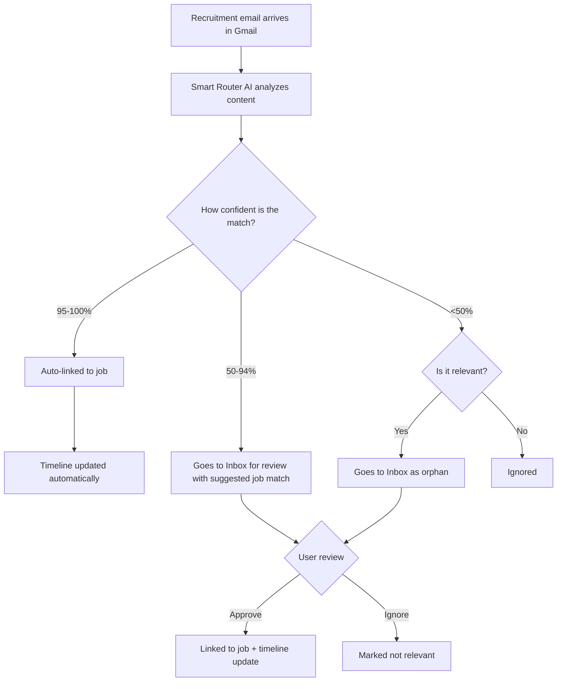

The easiest way to run JobOps is via Docker Compose. The app is self-configuring and guides you through setup on first launch.

## Prerequisites

- Docker Desktop or Docker Engine + Compose v2

## 1) Start the stack

No environment variables are required to boot:

```bash
docker compose up -d
```

This pulls the pre-built image from GHCR and starts the API, UI, and scrapers in one container.

To build locally instead:

```bash
docker compose up -d --build
```

## 2) Access the app and onboard

Open:

- **Dashboard**: `http://localhost:3005`

The onboarding wizard helps you validate and save:

1. **LLM Provider**: OpenRouter by default (or OpenAI/Gemini/local URL).
2. **PDF Export**: RxResume credentials for PDF generation.
3. **Template Resume**: Choose a base resume from your RxResume account.

Settings are saved to the local database.

## Gmail OAuth (Tracking Inbox)

If you want Gmail integration, configure OAuth credentials.

### 1) Create Google OAuth credentials

In Google Cloud:

1. Configure OAuth consent screen.
2. Enable Gmail API.
3. Create OAuth client ID (`Web application`).
4. Add redirect URI:
  - `http://localhost:3005/oauth/gmail/callback`
  - Or your production URL, for example `https://your-domain.com/oauth/gmail/callback`

### 2) Configure environment variables

- `GMAIL_OAUTH_CLIENT_ID` (required)
- `GMAIL_OAUTH_CLIENT_SECRET` (required)
- `GMAIL_OAUTH_REDIRECT_URI` (optional, recommended in production)

### 3) Restart and connect

- Restart container
- Open Tracking Inbox and click **Connect Gmail**

For a full step-by-step setup, exact scope requirements, and troubleshooting, see:

- [Gmail OAuth Setup](/docs/next/getting-started/gmail-oauth-setup)

## Email-to-job matching overview



## Persistent data

`./data` bind-mount stores:

- SQLite DB: `data/jobs.db`
- Generated PDFs: `data/pdfs/`

## Public demo mode

Set `DEMO_MODE=true` for sandbox deployments.

Behavior in demo mode:

- Works locally: browsing/filtering/status/timeline edits
- Simulated: pipeline run/summarize/process/rescore/pdf/apply
- Blocked: settings writes, DB clear, backups
- Auto-reset: every 6 hours

## Updating

```bash
git pull
docker compose pull
docker compose up -d
```

## Self-hosted Reactive Resume

If you self-host Reactive Resume, set:

- `RXRESUME_URL=http://rxresume.local.net`
