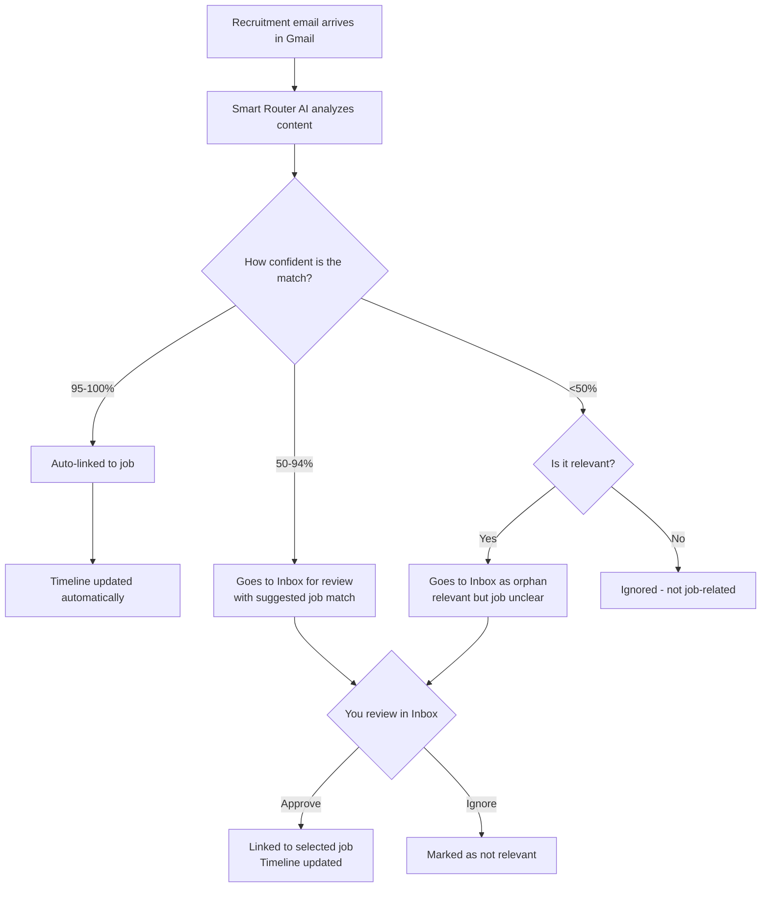

# Post-Application Email Tracking

The Post-Application Tracking feature (also called "Tracking Inbox") automatically monitors your Gmail for job application responses and updates your job timeline accordingly.

## Overview

After you've applied to jobs, keeping track of responses can be tedious. This feature automates that process by:

1. **Scanning your Gmail** for recruitment-related emails
2. **Matching emails** to your tracked job applications using AI
3. **Updating your timeline** with interview invites, offers, rejections, and updates
4. **Asking for your review** when the AI is uncertain

## How It Works

### The Smart Router Flow



### What the AI Analyzes

For each email, the Smart Router evaluates:

- **Content Relevance**: Is this email about a job application lifecycle?
- **Job Matching**: Which of your "Applied" or "Processing" jobs does this relate to?
- **Message Type**:
  - Interview invitation (phone screen, technical, onsite)
  - Offer received
  - Rejection/withdrawal
  - General update/status change
- **Confidence Score**: 0-100% certainty of the match

### Processing Outcomes

| Confidence              | Processing                     | Your Action Required                     |
| ----------------------- | ------------------------------ | ---------------------------------------- |
| **95-100%**             | Auto-linked to job             | None - appears in timeline automatically |
| **50-94%**              | Pending review with suggestion | Quick approve/ignore in Inbox            |
| **<50% (relevant)**     | Pending review as orphan       | Approve with manual job selection        |
| **<50% (not relevant)** | Ignored                        | None - filtered out                      |

## Setup

### Prerequisites

1. **Gmail account** with job application emails
2. **Google OAuth credentials** (see below)

### Step 1: Create Google OAuth Credentials

1. Go to [Google Cloud Console](https://console.cloud.google.com/)
2. Create a new project or select existing
3. Enable the **Gmail API**
4. Configure **OAuth consent screen**:
   - User Type: External
   - Fill in app name, user support email, developer contact
   - Add scope: `https://www.googleapis.com/auth/gmail.readonly`
   - Add test users (your email)
5. Create **OAuth 2.0 Client ID**:
   - Application type: Web application
   - Authorized redirect URIs:
     - `http://localhost:3005/oauth/gmail/callback` (local)
     - `https://your-domain.com/oauth/gmail/callback` (production)
6. Copy the **Client ID** and **Client Secret**

### Step 2: Configure Environment Variables

Set these in your JobOps environment:

```bash
GMAIL_OAUTH_CLIENT_ID=your-client-id.apps.googleusercontent.com
GMAIL_OAUTH_CLIENT_SECRET=your-client-secret
# Optional - defaults to /oauth/gmail/callback on current host
GMAIL_OAUTH_REDIRECT_URI=https://your-domain.com/oauth/gmail/callback
```

### Step 3: Connect Gmail in the UI

1. Restart JobOps with the new environment variables
2. Navigate to **Tracking Inbox** in the dashboard
3. Click **Connect Gmail**
4. Authorize JobOps to access your Gmail (read-only scope)
5. You're connected! The system will now sync emails automatically

## Using the Tracking Inbox

### Reviewing Pending Items

When emails need your review, they appear in the **Inbox**:

1. Go to **Tracking Inbox** → **Inbox** tab
2. Each item shows:
   - Sender and subject
   - AI confidence score
   - Suggested job match (if available)
   - Message type (interview, offer, etc.)
3. Choose an action:
   - **Approve**: Links to the suggested job (or select a different one)
   - **Ignore**: Marks as not relevant

### Understanding Confidence Scores

- **Green (95-100%)**: High confidence, auto-processed
- **Yellow (50-94%)**: Moderate confidence, needs review
- **Red (<50%)**: Low confidence or unclear match

### Timeline Updates

When you approve an email (or it's auto-approved), the system:

1. Creates a timeline event for the job
2. Updates the job stage (e.g., "Interview Scheduled", "Offer Received")
3. Records the event date from the email

## Privacy & Security

### What Data is Sent to AI

Only minimal job metadata is sent for matching:

- Company name
- Job title
- Snippets of email content

### Gmail Permissions

- **Scope**: `gmail.readonly` only
- **Access**: Read-only, cannot send/delete emails
- **Data Storage**: Email metadata stored locally in your SQLite database

### Data Retention

- Sync history retained for debugging
- You can disconnect Gmail at any time
- All email data is local to your instance

## Troubleshooting

### Common Issues

**"No refresh token" error**

- Disconnect and reconnect Gmail
- This forces a fresh consent flow

**Emails not appearing**

- Check sync run history in Tracking Inbox → Runs
- Verify Gmail OAuth credentials are correct
- Ensure email subjects match recruitment keywords

**Wrong job matches**

- This is expected for low-confidence matches
- Use the Inbox to correct matches

### Viewing Sync History

Go to **Tracking Inbox** → **Runs** to see:

- When syncs ran
- How many messages were discovered
- How many were auto-linked vs. pending review
- Any errors that occurred

## Configuration

### Environment Variables

| Variable                    | Required | Description                    |
| --------------------------- | -------- | ------------------------------ |
| `GMAIL_OAUTH_CLIENT_ID`     | Yes      | Google OAuth client ID         |
| `GMAIL_OAUTH_CLIENT_SECRET` | Yes      | Google OAuth client secret     |
| `GMAIL_OAUTH_REDIRECT_URI`  | No       | Custom redirect URI (optional) |

### Advanced Settings

Currently, the feature uses sensible defaults:

- Searches last 30 days of emails
- Looks for recruitment-related keywords in subjects
- Processes up to 100 messages per sync
- Runs automatically when you open the Tracking Inbox

## API Reference

### REST Endpoints

| Method | Endpoint                                  | Description           |
| ------ | ----------------------------------------- | --------------------- |
| GET    | `/api/post-application/inbox`             | List pending messages |
| POST   | `/api/post-application/inbox/:id/approve` | Approve message       |
| POST   | `/api/post-application/inbox/:id/deny`    | Ignore message        |
| GET    | `/api/post-application/runs`              | List sync runs        |
| POST   | `/api/post-application/gmail/connect`     | Start OAuth flow      |
| GET    | `/api/post-application/gmail/callback`    | OAuth callback        |

### Example: Approve an Inbox Item

```bash
curl -X POST http://localhost:3005/api/post-application/inbox/msg_123/approve \
  -H "Content-Type: application/json" \
  -d '{
    "jobId": "job_456",
    "note": "Phone screen scheduled"
  }'
```

## Best Practices

1. **Review regularly**: Check your Inbox weekly to stay on top of pending matches
2. **Be decisive**: Approve or ignore items quickly to keep your Inbox clean
3. **Correct mismatches**: If the AI suggests the wrong job, select the correct one when approving
4. **Monitor sync runs**: Check the Runs tab occasionally to ensure syncing is working
5. **Privacy first**: Remember only minimal job data is sent to AI - your email content stays private

## Future Enhancements

Potential improvements planned:

- Multiple email provider support (Outlook, etc.)
- IMAP support for non-Gmail accounts
- Calendar integration for interview scheduling
